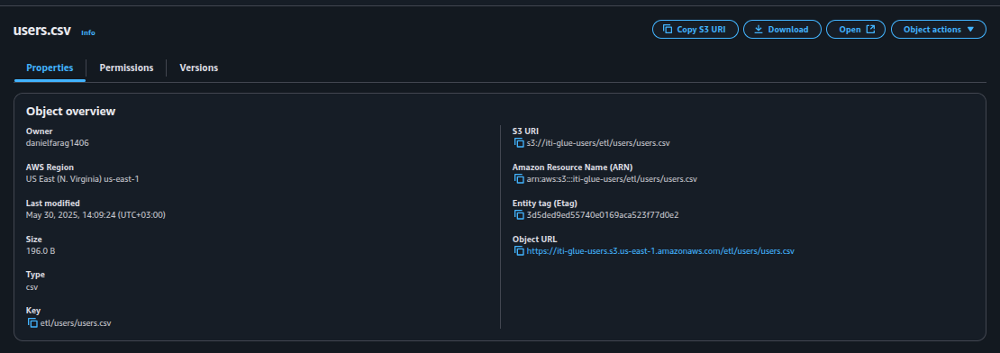
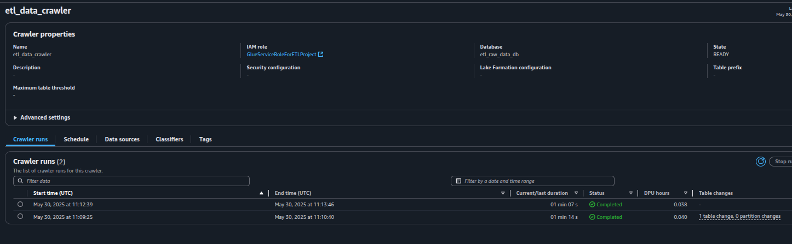
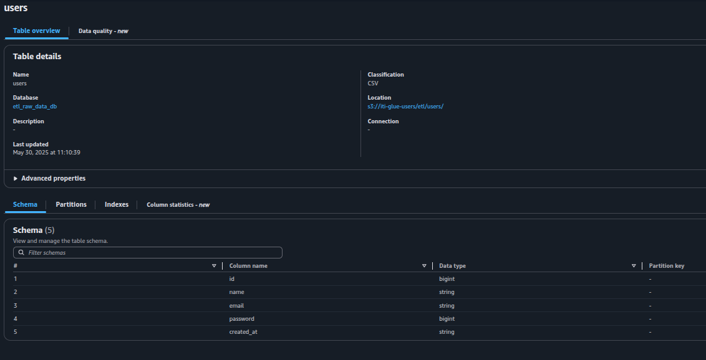
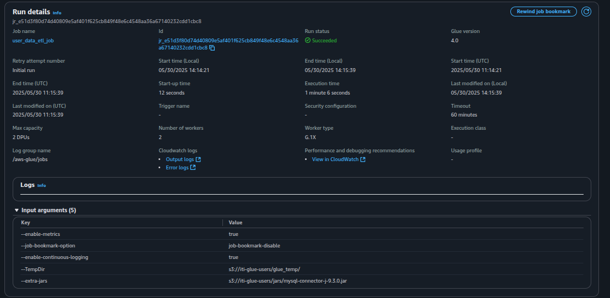
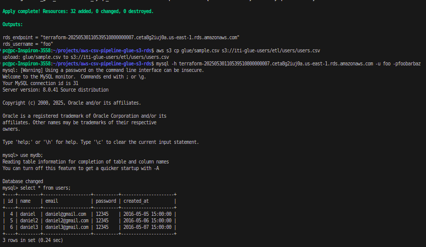
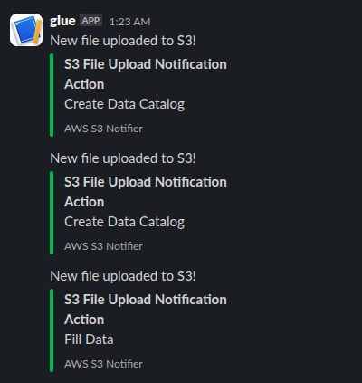

# AWS ETL Pipeline with Glue, RDS, and Lambda

This project sets up an automated Extract, Transform, Load (ETL) pipeline on AWS using a combination of services, including **Amazon RDS (MySQL)** as a data target, **AWS Glue** for data cataloging and transformations, **Amazon S3** for data staging and script storage, and **AWS Lambda** and **CloudWatch Events** for workflow orchestration and notifications.

---

## Architecture Overview

The pipeline operates as follows:

1.  **Data Ingestion**: Raw user data (e.g., CSV files) is expected to be uploaded to a specified S3 bucket (`s3://iti-glue-users/etl/users/`).
2.  **S3 Event Trigger**: An S3 object creation event triggers an AWS Lambda function.
3.  **Crawler Execution**: The Lambda function initiates an AWS Glue Crawler, which scans the S3 path (`s3://iti-glue-users/etl/users/`) to discover the schema of the uploaded data and update the Glue Data Catalog (`users_catalog`).
4.  **Job Execution (Event-Driven)**: Once the Glue Crawler successfully completes, a CloudWatch Event Rule is triggered. This rule, in turn, invokes the same Lambda function but with a different payload, signaling the start of the Glue ETL job.
5.  **Data Transformation and Loading**: The AWS Glue ETL job (`user_data_etl_job`) reads data from the Glue Data Catalog, performs transformations (e.g., timestamp conversion, email validation), and loads the processed data into the MySQL database hosted on RDS.
6.  **Notifications**: The Lambda function sends notifications to a specified Slack channel at key stages of the pipeline (e.g., "Create Data Catalog" and "Fill Data").
7.  **MySQL Connector**: A MySQL JDBC connector JAR is stored in S3 and used by the Glue job to connect to the RDS MySQL instance.

---

## Screenshots








---

## Prerequisites

Before deploying this infrastructure, ensure you have the following:

* **AWS CLI Configured**: Your AWS CLI is configured with appropriate credentials and a default region.
* **MySql Client**: [MySQL Client](https://dev.mysql.com/downloads/mysql/) is installed on your local machine..
* **Terraform Installed**: [Terraform](https://www.terraform.io/downloads.html) is installed on your local machine.

---

## Deployment

1.  **Initialize Terraform**:
    ```bash
    terraform init
    ```

2.  **Review the Plan**:
    ```bash
    terraform plan
    ```

3.  **Apply the Configuration**:
    ```bash
    terraform apply
    ```
    You will be prompted to enter values for the following variables:
    * `slack_webhook_url`: The URL for your Slack incoming webhook to receive notifications.

---

## Post-Deployment Steps

After successful deployment, you will have:

* An AWS VPC with public subnets, an Internet Gateway, and a route table.
* An RDS MySQL instance with a dedicated subnet group and security group.
* An S3 bucket (`iti-glue-users`) configured for public access blocking and object notifications.
* An AWS Glue Data Catalog database (`users_catalog`) and a Glue Crawler (`users_catalog_crawler`).
* An AWS Glue ETL job (`user_data_etl_job`).
* An AWS Lambda function (`notify_via_slack`) responsible for orchestrating the Glue workflow and sending Slack notifications.
* IAM roles and policies providing necessary permissions for Glue, Lambda, and EventBridge.
* CloudWatch Event rules to trigger the Lambda function based on Glue Crawler success.

---

## Usage

1.  **Upload Data**: To initiate the ETL pipeline, upload your user data files (e.g., `users.csv`) to the `etl/users/` prefix in your S3 bucket (`s3://iti-glue-users/etl/users/`).
```sh
aws s3 cp glue/sample.csv s3://iti-glue-users/etl/users/users.csv
```
2.  **Monitor Progress**:
    * **Slack**: Monitor your configured Slack channel for notifications about the pipeline's progress (e.g., "Create Data Catalog," "Fill Data").
    * **AWS Glue Console**: Observe the status of the Glue Crawler (`users_catalog_crawler`) and Glue Job (`user_data_etl_job`).
    * **Amazon RDS Console**: Verify that the processed data is being loaded into your MySQL database.
    * **CloudWatch Logs**: Check the logs of your Lambda function (`notify_via_slack`) for any errors or detailed execution information.

---

## Customization

* **RDS Instance**: Modify `instance_class`, `allocated_storage`, `engine_version`, and other parameters in the `aws_db_instance.etl_mysql_db` resource to suit your database requirements.
* **Glue Job**: Update the `glue_user.py` script to include your specific data transformation logic.
* **S3 Paths**: Adjust the `s3_target` in `aws_glue_crawler.etl_data_crawler` and `script_location` in `aws_glue_job.user_data_etl_job` if your S3 data or script paths change.
* **Lambda Function**: Modify `lambda.js` to customize Slack messages or add more intricate orchestration logic.
* **Security Group Ingress**: For production environments, tighten the `cidr_blocks` in the `aws_security_group.etl_rds_security_group` to restrict access to your database to known IP addresses or subnets. The current `0.0.0.0/0` allows public access.
* **VPC and Subnets**: Adjust CIDR blocks for the VPC and subnets if they conflict with your existing network architecture.

---

## Cleanup

To destroy all the resources created by this Terraform configuration, run:

```bash
terraform destroy
```